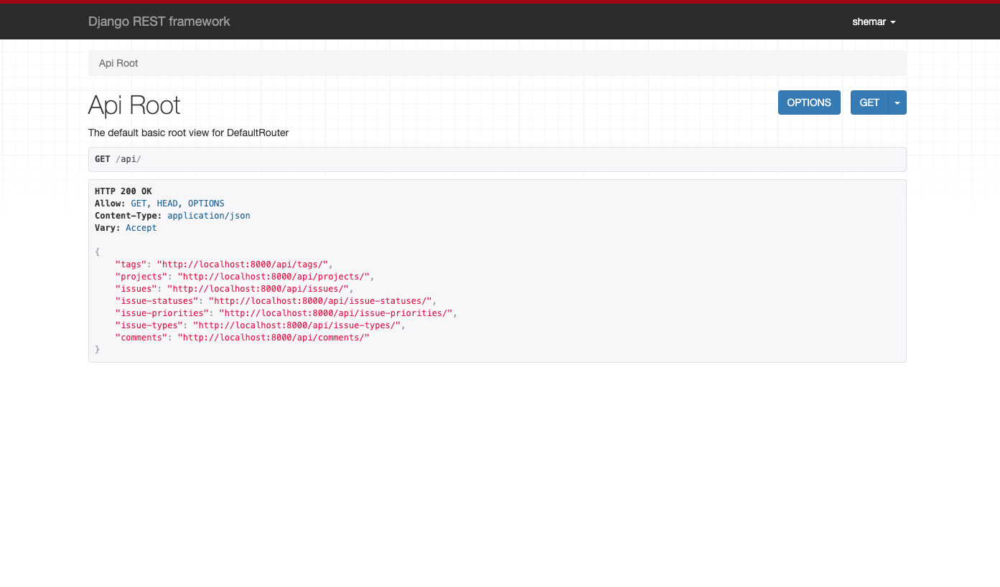

# A Django-powered API



## Overview
- Built with Django 3
- Uses [Rest Framework](https://github.com/encode/django-rest-framework) for API views
- Uses [Knox Token Authentication](https://github.com/James1345/django-rest-knox)
- Has examples of:
    - JSON API views (`issue`, `polls`, `auth`)
    - Regular Django views (`polls`)

## Project Structure
- `django_api/api` - API apps
- `django_api/modules` - Regular apps
- `django_api/utils` - Utils app

## Requirements
- Python 3
- [Pipenv](https://github.com/pypa/pipenv)

## Setup

1. Install dependencies
> pipenv install

2. Open Pipenv shell
> pipenv shell

3. Make DB migrations
> python manage.py makemigrations

> python manage.py makemigrations polls issue

4. Run migrations
> python manage.py migrate

5. Create superuser
> python manage.py createsuperuser

Follow the prompts to create an admin user.

5. Load fixture data (optional)
> python manage.py loaddata issue/all

This will load dummy data for the issue module. It includes:
- Users
- Issue metadata records (tags, types, statuses, etc)
- Projects
- Issues

## Run

> python manage.py runserver

#### Try:

- Admin Backend: http://localhost:8000/admin/
- API Explorer: http://localhost:8000/api/

- Auth API: http://localhost:8000/api/auth

- Polls app: http://localhost:8000/apps/polls/

#### API Authentication

- Login with Basic Auth at http://localhost:8000/api/auth/login. This will return the following payload:
```
{
    "expiry": "2021-09-07T20:51:49.354313-04:00",
    "token": "<auth token>",
    "user": {
        "id": 1,
        "username": "user",
        "email": "user@example.com",
        "first_name": "Example",
        "last_name": "User",
        "last_login": "2021-09-06T20:51:49.356207-04:00",
        "is_active": true,
        "date_joined": "2021-09-06T18:07:32-04:00",
        "is_staff": true,
        "is_superuser": true
    }
}
```

Use `<auth token>` with the `Authorization` header on subsequent request like this:
```
Authorization: Token <auth token>
```

## Frontend

See [Issue Tracker](https://github.com/shemarlindie/issue-tracker) implementation for a frontend to the `issue` API.
